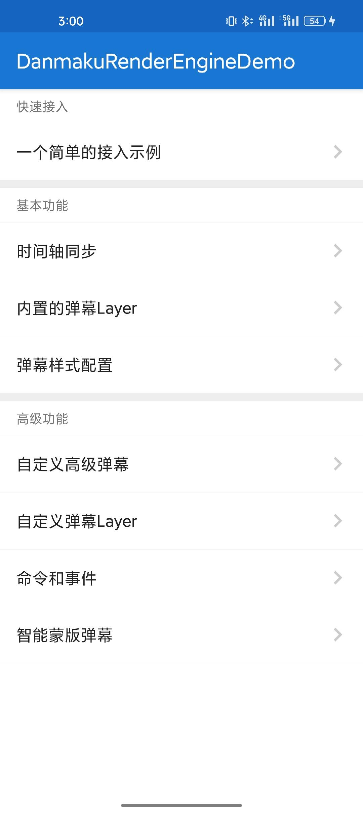
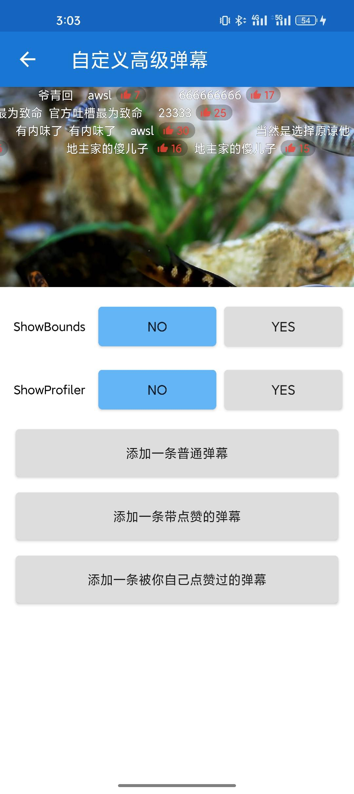
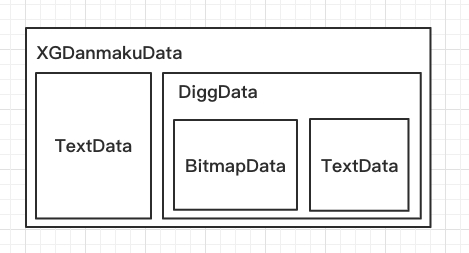

# DanmakuRenderEngine

[](/LICENSE)
[](https://developer.android.com/about/dashboards)

DanmakuRenderEngine 是一个轻量级、高扩展性的通用弹幕库，主要特性：

1. 高性能的渲染和绘制
2. 简单易用的接口和低成本的接入方式
3. 支持复杂的自定义弹幕样式
4. 支持自定义弹幕运动方式

[下载 Demo >>>](https://github.com/bytedance/DanmakuRenderEngine/releases/download/v0.1.0/demo.apk)

|  |  |  |  
|:-----------:|:-----------:|:-----------:|:-----------:|

## 正在使用 DanmakuRenderEngine 的应用

|  |  |  |  |
|:-----------:|:----:|:-------:|:-----:|
| 西瓜视频 | 抖音 | 今日头条 | 懂车帝 |

## 快速接入

添加仓库源：

```gradle
allprojects {
	repositories {
		...
		maven { url 'https://artifact.bytedance.com/repository/releases/' }
	}
}
```

在依赖中添加：

```gradle
implementation 'com.github.bytedance:danmaku-render-engine:$latest_version'
```

在最简单的场景下，仅需要四步即可接入并开始播放弹幕：

1. 在播放器布局XML中放置和视频画面大小一致的`DanmakuView`
2. 通过`danmakuView.controller`拿到弹幕的控制器`DanmakuController`
3. 为每条弹幕构造一个`TextData`，默认情况仅需要填入`text`、`LayerType`和`showAtTime`字段
4. 调用`controller.setData()`设置数据，然后使用`controller.start()`即可开始播放弹幕

## 时间轴同步

### 弹幕控制

`DanmakuController`提供了四个与时间轴控制相关的方法：

```
fun start(playTime: Long)  // 播放，或从暂停状态恢复播放
fun pause()                // 暂停，画面上的弹幕停在原地
fun stop()                 // 停止，清除画面上的弹幕并重置时间轴
fun clear()                // 清屏，单独清除屏幕上已经显示的弹幕
```

### 播放同步

按照业界弹幕较通用的实现逻辑，播放器的回调和`DanmakuController`控制方法对应如下，  
如果有特殊需求也可以对 DanmakuRenderEngine 框架的控制逻辑进行定制：

| 播放器回调 | 含义 | DanmakuController方法 | 注释 |
|:--------:|:----:|:--------------------:|:----:|
|RenderStart|播放器首帧|start||
|VideoPause|播放暂停|pause||
|VideoResume|播放恢复|start||
|VideoStop|停止播放|pause|目的是让在视频播放完成后未滚动完的弹幕停留在原地|
|VideoReplay|重播|stop||
|VideoError|播放失败|pause||
|onSeekStart|开始Seek进度|pause||
|onSeekComplete|Seek进度完成|clear; if (isPlaying) {start}|Seek进度完毕后应该清屏|
|onBufferStart|开始缓冲|pause||
|onBufferEnd|缓冲完毕|start||

### 其他形态的业务

DanmakuRenderEngine 弹幕库并不与视频播放逻辑耦合，如果想要实现类似 QQ 空间的图片弹幕，做法也是类似的。

## 自定义运动方式

DanmakuRenderEngine 弹幕库的渲染结构根据运动方式的不同被分为不同的层（Layer），  
每个渲染层自己管理排版和渲染，渲染层之间则由`z-index`属性来控制层级顺序。

DanmakuRenderEngine 弹幕库默认情况下支持三种弹幕的运动方式：

1. ScrollLayer：从右往左滚动
2. TopCenterLayer：在屏幕顶部中间显示
3. BottomCenterLayer：在屏幕底部中间显示

若想开发自定义的运动方式，只需要按照`IRenderLayer`的要求对接口进行实现，调用`DanmakuController.addRenderLayer()`进行注册，  
然后在弹幕数据中指定`LayerType`为你定义的`Layer`，DanmakuRenderEngine 就会在渲染时自动将这条弹幕交给对应的`Layer`进行排版和绘制了。

## 自定义弹幕样式

### 定义

DanmakuRenderEngine 弹幕库在设计时将一条弹幕分成了数据实体（DanmakuData）和绘制实体(DrawItem)：

1. DanmakuData只包含这条弹幕的属性信息，在设置后除非主动修改否则内容不会变化
2. DrawItem定义这条弹幕是如何绘制的，同时包含这条弹幕绘制时的属性（x/y/宽/高等）
3. DrawItem在渲染过程中属性会被RenderLayer的逻辑不断修改，在弹幕移出屏幕后会被回收并复用

因此，想要自定义弹幕样式需要实现三个类：

1. CustomDanmakuData：数据实体类
2. CustomDrawItem：绘制实体类
3. CustomDrawItemFactory：绘制实体的工厂类

然后调用`DanmakuController.registerDrawItemFactory`对自定义的工厂类进行注册，  
这样 DanmakuRenderEngine 在遇到自定义的`CustomDanmakuData`时就会使用会注册的工厂类生成`CustomDrawItem`进行渲染了。

### 实现

基于组合优于继承的思想，DanmakuRenderEngine 弹幕库默认提供文字（TextData）和图片（BitmapData）两种弹幕样式，  
高级自定义弹幕样式则由业务方将上述两种样式组合而成。

自定义的Data和DrawItem需要定义相同的层级结构，  
在bindData或者x、y等属性发生变化时可以将新的值向下进行分发。

以西瓜视频的弹幕样式为例，在文字后面会跟一个点赞图标和点赞数：


而弹幕数据结构组合如下：



同时在DrawItem内，在绘制时能拿到绘制时的Canvas，  
上图中弹幕点赞结构的背景，就是使用Canvas绘制的。

## 弹幕设置

### 需求

通常情况下我们会有对弹幕属性进行修改的需求，例如：

1. 全屏后字体、行高变大，退出全屏变小
2. 点赞弹幕后字体变色
3. 全局修改字体大小、透明度等

在 DanmakuRenderEngine 框架中，主要通过`DanmakuController.config`来对弹幕进行控制

### 层叠与优先级

根据实际需求，在配置上设计了类似于CSS的层叠与优先级的概念。

首先`Config`中是全局配置字段，根据作用范围分为：

```kotlin
val debug = DebugConfig(this)
val common = CommonConfig(this)
val text = TextConfig(this)
val underline = UnderlineConfig(this)
val scroll = ScrollLayerConfig(this)
val top = TopCenterLayerConfig(this)
val bottom = BottomCenterLayerConfig(this)
```

以文字的`TextConfig`为例，有`size`、`color`等属性，  
而同时TextData中也有相同作用的`TextSize`、`TextColor`等属性。

若`TextData`定义了某条属性时，以`TextData`中定义的为准，  
在`TextData`中未定义时，则以`Config`中定义的为准。

例如如果在正文的`TextData`中不对`TextSize`赋值，而在点赞数字的`TextData`中对`TextSize`赋值，  
则当我们在进入全屏时增加`Config.text`中的`size`属性时，就能对弹幕的正文字体大小进行放大，同时点赞数字的大小则始终保持不变。

## 命令和事件

对于一个弹幕框架，通常来说会有两种需求：

1. 命令框架做一些事情，比如：
    1. 暂停一条弹幕
    2. 改变一条弹幕的颜色
2. 框架通知外部一些事情发生了，比如：
    1. 一条弹幕被添加进屏幕显示出来
    2. 一条弹幕被移出屏幕
    3. 一条弹幕的大小变化了

DanmakuRenderEngine框架针对这两类需求，设计了**命令**和**事件**两套机制来进行处理

### 命令

命令（DanmakuCommand）用于业务方通知弹幕框架做一些事情，  
主入口是`DanmakuController.executeCommand()`，例如：

```kotlin
mController?.executeCommand(CMD_PAUSE_ITEM, data)           // 暂停一条弹幕
mController?.executeCommand(CMD_RESUME_ITEM, data)          // 恢复一条弹幕
mController?.executeCommand(CMD_SET_TOUCHABLE, null, false) // 使弹幕View不可点击
```

### 事件

事件（DanmakuEvent）用于弹幕框架通知业务方一些事情发生了，  
业务方可以通过`DanmakuController.addEventListener()`来注册监听，  
在回调中通过`DanmakuEvent.what`属性来判断`Event`的类型，例如：

```kotlin
override fun onEvent(event: DanmakuEvent) {
    when (event.what) {
        EVENT_DANMAKU_SHOW -> {}     // event.data这条弹幕出现在屏幕上
        EVENT_DANMAKU_DISMISS -> {}  // event.data这条弹幕从屏幕上消失了
        EVENT_DANMAKU_REMEASURE -> {
            (event.param as? RectF)?.let { rectF ->
                // event.data这条弹幕被重新测量了，rectF是这条弹幕新的大小
            }
        }
    }
}
```

## 蒙版弹幕

「蒙版弹幕」是一种高级弹幕功能，能实现「不遮挡人像」的效果，  
即开启该功能后，弹幕就不会再覆盖人像，而是呈现从人体身后穿过的效果。

DanmakuRenderEngine 框架内置了该功能的实现，只需简单几步即可实现「蒙版弹幕」：

1. 提前分析视频的画面内容，计算出每一帧需要抠出人像的闭合SVG路径
2. 将遮罩路径通过`Path`的形式组装成`MaskData`数据结构
3. 将`MaskData`数据和其他弹幕数据一样设置给`DanmakuController`
4. 打开蒙版弹幕功能开关即可：`DanmakuController.config.mask.enable = true`

（上述代码可以参考Demo工程中的[SmartMaskActivity.kt](/demo/src/main/java/com/bytedance/danmaku/render/engine/demo/demo/SmartMaskActivity.kt)）

需要注意的是：

1. DanmakuRenderEngine 框架仅提供了「蒙版弹幕」功能在Android平台的具体实现，不提供对画面内容进行分析生成遮罩路径的功能， 
   通常情况下需要业务方自己在服务端提前通过AI工具对画面内容进行分析处理，然后在播放时将数据下发给客户端
2. DanmakuRenderEngine 框架本身对于`MaskData`遮罩的帧率没有限制，但出于性能和数据传输方面的考虑，一般来说不会高于30Hz（大于10Hz时效果已经非常好了），
   同时 DanmakuRenderEngine 框架也支持动态帧率的遮罩，在组装`MaskData`时指定每一项数据的起止时间即可

## Q&A

#### Q1：我可以动态插入DanmakuView吗？

A：可以。需要时可以new一个`DanmakuView`并覆盖到视频画面上方，只要保证`DanmakuView`和视频画面的大小始终保持一致即可（例如在切换全屏时）。

#### Q2：我可以先播放，再设置弹幕数据吗？

A：可以。但`showAtTime`在设置时间点之前的弹幕本次播放不会被显示（如果往前Seek，这些弹幕仍然可以显示出来）。
        
### License

    Copyright (c) 2022 ByteDance Inc

    Licensed under the Apache License, Version 2.0 (the "License");
    you may not use this file except in compliance with the License.
    You may obtain a copy of the License at

    http://www.apache.org/licenses/LICENSE-2.0

    Unless required by applicable law or agreed to in writing, software
    distributed under the License is distributed on an "AS IS" BASIS,
    WITHOUT WARRANTIES OR CONDITIONS OF ANY KIND, either express or implied.
    See the License for the specific language governing permissions and
    limitations under the License.